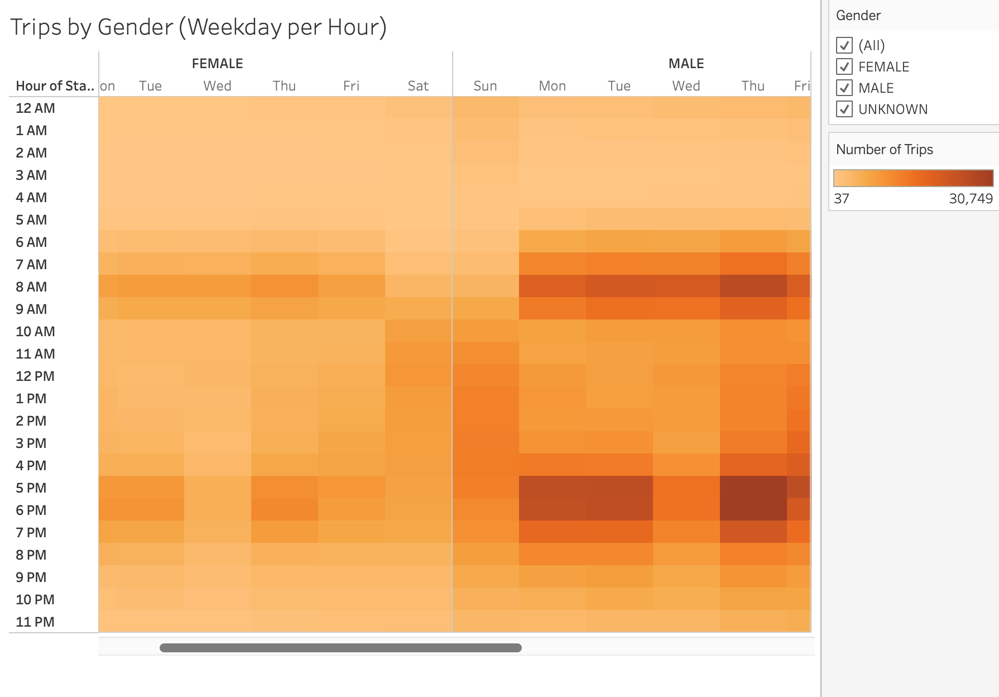

# Citibike Challenge

## Overview of the Statistical Analysis

### Purpose

The purpose of the analysis is to provide insight, through Tableau Public visualizations, into the viability of a hypothetical bikesharing business. This is done by using a dataset for bikesharing in NYC for the month of August, year 2019.

## Results

### Visualizations and Description

* **Top Starting Locations**: Marker size and color intensity represents concentration of number of trips. As it can be observed, there seems to be a higher concentration in, roughly, the third cuadrant of the visualization.

* **Top Ending Locations**: Marker size and color intensity represents concentration of number of trips. As in the previous visualization, there seems to be a higher concentration in, roughly, the third cuadrant, although with a slightly greater presence of trips ending in the fourth quadrant.

* **Checkout Times for Users**: Nearly all of the trips in the dataset lasted less than an hour.

* **Checkout Times by Gender**: Shows a similar situation as the previous visualization, although in this one we can observe that female riders are more abundant than male rides.

* **Trips by Weekday per Hour**: For Mon-Fri there seems to be a greater concentration of trips in the periods "7 am - 9 am" and "5 pm - 7 pm", most likely reflecting work shedules. On the other hand, for weekends, that is Sat-Sun, there seems to be a higher dispersion of trips throughout the day, with a slight upstick in the period "10 am - 4 pm".

* **Trips by Gender**: General trends described in the previous visualization seem to apply in this one as well. Nevertheless, here we can observe that trips associated with male riders are less disperse than those associated with female riders.

* **User Trips by Gender by Weekday**: Customer User Types display no discernible pattern. On the other hand, Subscriber User Types reflect the gender distinction pointed out in the previous visualization.

## Summary

### Summary of Results and Two Additional Suggestions

**In terms of summarizing the results of the analysis, there a three key observations**:
1) Work patterns are clearly reflected unto trip patterns.
2) The previous key observation is more pronounced in the case of male riders.
3) Suscribers make up most of the bikesharing business for the dataset under consideration.

**Two Additional Visualization Suggestions**: 
1) A greater degree of certainty with respect to key observation "1)" (see above) could be attained with a visualization that incorporates a dimension of the sort "motive for trip" and integrates it into a map similar to "Top Starting Locations" and "Top Ending Locations".
2) A visualization that incorporates a spatial quantitative measure of dispersion into a map similar to "Top Starting Location" or "Top Ending Locations".

## Link to Tableau Public Dashboard:

[CITIBIKE CHALLENGE DASHBOARD](https://public.tableau.com/app/profile/carlos2296/viz/CitibikeChallenge_16403931850400/Story1)
